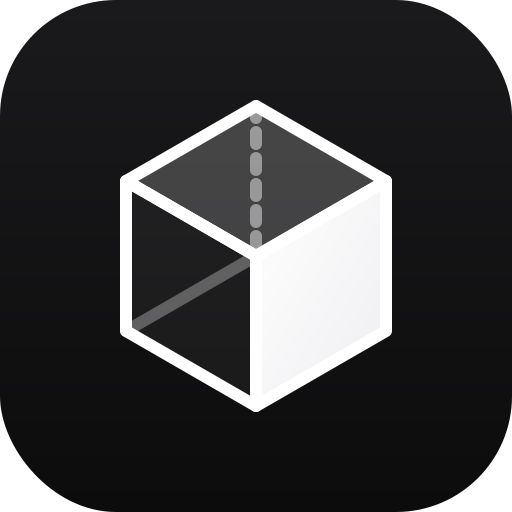

<div align="center">



</div>

# LiteS3

A simple and efficient personal object storage file manager.

简洁高效的个人对象存储文件管理系统。

[](https://vercel.com/new/clone?repository-url=https://github.com/LogLInk1K/LiteS3)

</div>

---

## What is LiteS3?

LiteS3 is a self-hosted file management interface for any S3-compatible object storage service. Whether you use Cloudflare R2, AWS S3, MinIO, or anything else — LiteS3 gives you a clean, modern web UI to browse, upload, and manage your files.

No complex setup. No vendor lock-in. Just connect your bucket and go.

## Features

- **Multi-bucket support** — Connect and manage multiple S3-compatible buckets
- **File operations** — Upload, download, delete, rename, move, copy
- **File preview** — Images, videos, audio, code (syntax highlighting), Markdown, plain text
- **Folder navigation** — Breadcrumb paths, create folders
- **Batch operations** — Multi-select files, batch delete / move / copy / download
- **Grid & list views** — Switch between card and table layouts
- **Right-click context menu** — Quick actions
- **Dark / light / system theme** — Smooth transitions
- **Bilingual** — English & Chinese
- **Setup wizard** — Guided database configuration and admin account creation
- **Responsive design** — Desktop and mobile

## Quick Start

### One-Click Deploy (Vercel)

Click the button above, then add these environment variables in the Vercel dashboard:

| Variable | Required | Description |
|---|---|---|
| `DATABASE_URL` | Yes | Database connection string (see below) |
| `NEXTAUTH_SECRET` | Yes | Random string for JWT signing |
| `ENCRYPTION_KEY` | Yes | Random string for data encryption |

### Local Development

```bash
git clone https://github.com/LogLInk1K/LiteS3.git
cd LiteS3
npm install
cp .env.example .env.local
npm run dev
```

Visit `http://localhost:3000` — the setup wizard will guide you through the rest.

## Database

LiteS3 auto-detects the database type from the `DATABASE_URL` environment variable:

| `DATABASE_URL` | Type |
|---|---|
| *(not set)* | SQLite (local file) |
| `file:...` | SQLite (local file) |
| `libsql://...` | SQLite (Turso) |
| `postgres://...` or `postgresql://...` | PostgreSQL |

For Turso, also set `DATABASE_AUTH_TOKEN`.

## S3-Compatible Services

LiteS3 works with any S3-compatible storage. Common endpoints:

| Service | Endpoint |
|---|---|
| Cloudflare R2 | `https://<account_id>.r2.cloudflarestorage.com` |
| AWS S3 | `https://s3.<region>.amazonaws.com` |
| MinIO | `http://localhost:9000` |

## Tech Stack

Next.js 16 · React 19 · Tailwind CSS 4 · Drizzle ORM · NextAuth.js · AWS S3 SDK

## License

[AGPL-3.0](LICENSE)
